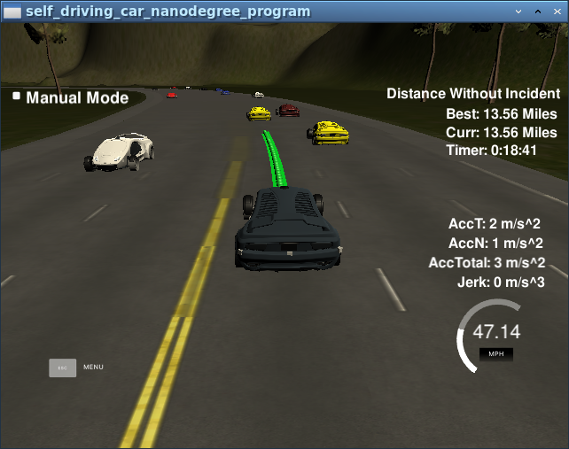
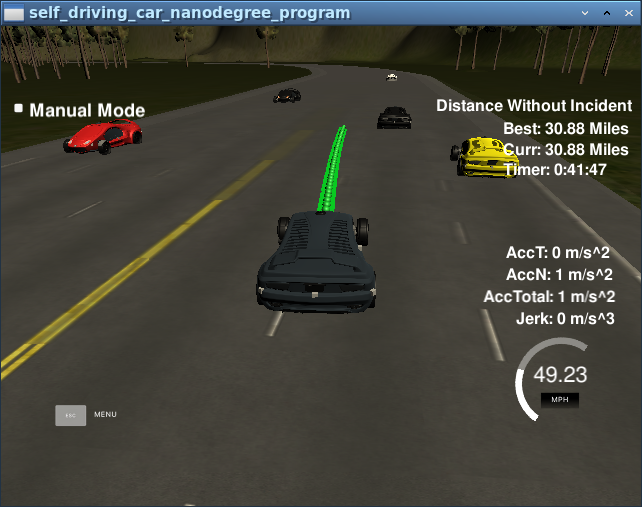

# CarND-Path-Planning-Project

## Goals
In this project the goal is to safely navigate around a virtual highway with other traffic that is driving +-10 MPH of the 50 MPH speed limit, and meet the following criteria:
* Drives 4.32 miles without incident - completes one loop (6946m)
* Drives close to or under the 50MPH speed limit
* Max acceleration (10 m/s^2) and max jerk (10 m/s^3)
* No collisions
* Stays in lane except when changing lanes (max 3 seconds)
* Smooth lane changes when required

The car's localization and sensor fusion data is provided and there is also a sparse map list of waypoints around the highway.

This document sets out the process of developing the model and the current results and state of the project.

---

## Getting smooth trajectories
By making use of the suggested [spline tool](https://kluge.in-chemnitz.de/opensource/spline/) with the `spline.h` function, a subset of the sparse waypoints (in the current  solution, 3 ahead and 3 behind the current car position) are used to generate smooth splines, which are then able to create a denser grid of closer sub-waypoints for the car to follow. The initial speed limit is set to 49.5 in order to see if the car would behave as planned.

## Define model behaviour
The code implemented to obtain smooth trajectories in the previous step is successful in allowing the car to remain in its own lane regardless of what obstacles it may find in its way. The next step would be to determine what steps the car should take in order to remain at its optimum speed as close to the speed limit as possible.
1. The `sensor_fusion` data is read in order to slow the car down by 5m/s^2 should it find another car within 30m in its path. Should the path be clear, the car should increase it's acceleration by 5m/s^2 until it arrives close to the speed limit (set at 49 m/s, line 232 of main.cpp).
2. Once this is successfully implemented, the next step is to implement a lane change where possible. This is done by checking the left and right lanes for cars which may be up to 30m ahead (in the next time step, due to the delay) and also up to 10m behind the ego vehicle, in order to be extra sure collisions may be avoided. Left lane changes are checked first, followed by the right lane change.

The initial performance was satisfactory, with the minimum requirements of the assignment being met - driving 4.32 miles without incident. But there was still an occasional collision, or the rare acceleration limit being reached specifically when changing lanes and it never reached 15 miles incident-free. So I wanted to see the effect that some minor tweaking would have on the model.

## Modifications to the initial model
1. Originally, the changing of lanes was made before slowing down, but this occasionally caused the maximum acceleration to be exceeded, so the algorithm was tweaked to slow the car down slightly before trying to change lanes.

2. The deceleration is smoothed to only slow down as a function of the current speed and the speed of the vehicle ahead - not with a constant deceleration - so as to reduce the rhythmic yoyo-ing between slowing down and speeding up when stuck in a situation when it is not possible for a change in lanes because of cars in neighbouring lanes as well.

3. The checking of vehicles in the left and right lane were extended from 30m ahead to 10m behind the current vehicle - this is to avoid the cases where a car would pull up alongside and suddenly speed up, causing a collision.

## Performance
The tweaked model successfully met all the goals as detailed in the first step, and managed to drive for a considerable amount of time (>30 miles and counting as I stopped the simulator after 40 minutes) switching lanes without any incidents - no collisions, nor exceeding the max acceleration and jerk set out, while driving close to the 50MPH speed limit whenever possible.

Next steps to implement would be to introduce cost functions rather than simple boolean logic for the lane changes in order to decide on the best trajectories (more than one lane if necessary) or the slowing down and speeding up of the ego vehicle according to lane speeds. And to pre-empt close-range lane changes from vehicles two lanes away, as this was one of the causes of the rare collisions that the current solution could not avoid.

---
